# Mobile Vis Design Space

```mermaid
graph TD
    %% ---Nodes---
    L0["(L0) 可视化容器 (VisualizationContainer)"]

    L1_Data["(L1) 数据模型 (DataModel)"]
    L1_Narrative["(L1) 叙事层 (NarrativeLayer)"]
    L1_Interaction["(L1) 交互层 (InteractionLayer)"]
    L1_Chart["(L1) 图表组件 (ChartComponents)"]

    L2_Annotations["(L2) 标注 (Annotations)"]
    L2_Emphases["(L2) 高亮 (Emphases)"]
    
    L2_Features["(L2) 功能 (Features)"]
    L2_Triggers["(L2) 触发器 (Triggers)"]
    L2_Feedback["(L2) 反馈 (Feedback)"]

    L2_Title["(L2) 标题块 (TitleBlock)"]
    L2_CoordSys["(L2) 坐标系 (CoordinateSystem)"]
    L2_DataMarks["(L2) 数据标记 (DataMarks)"]
    L2_Aux["(L2) 辅助组件 (AuxiliaryComponents)"]

    L3_Title_Main["(L3) 主标题 (Title)"]
    L3_Title_Sub["(L3) 副标题 (Subtitle)"]

    L3_Axes["(L3) 坐标轴 (Axes)"]
    L3_Gridlines["(L3) 网格线 (Gridlines)"]

    L4_AxisLine["(L4) 轴线 (AxisLine)"]
    L4_AxisTitle["(L4) 轴标题 (AxisTitle)"]
    L4_Ticks["(L4) 刻度 (Ticks)"]

    L5_TickLine["(L5) 刻度线 (TickLine)"]
    L5_TickLabel["(L5) 刻度标签 (TickLabel)"]

    L3_MarkSet["(L3) 标记集合 (MarkSet)"]
    L4_MarkInstance["(L4) 标记实例 (MarkInstance)"]
    L4_MarkLabel["(L4) 标记标签 (MarkLabel)"]

    L3_Legend["(L3) 图例块 (LegendBlock)"]
    L4_LegendTitle["(L4) 图例标题 (LegendTitle)"]
    L4_LegendItems["(L4) 图例条目 (LegendItems)"]
    
    L5_LegendSymbol["(L5) 图例符号 (LegendSymbol)"]
    L5_LegendText["(L5) 图例文字 (LegendText)"]

    %% ---Links) ---
    L0 --> L1_Data
    L0 --> L1_Narrative
    L0 --> L1_Interaction
    L0 --> L1_Chart

    L1_Narrative --> L2_Annotations
    L1_Narrative --> L2_Emphases

    L1_Interaction --> L2_Features
    L1_Interaction --> L2_Triggers
    L1_Interaction --> L2_Feedback

    L1_Chart --> L2_Title
    L1_Chart --> L2_CoordSys
    L1_Chart --> L2_DataMarks
    L1_Chart --> L2_Aux

    L2_Title --> L3_Title_Main
    L2_Title --> L3_Title_Sub

    L2_CoordSys --> L3_Axes
    L2_CoordSys --> L3_Gridlines

    L3_Axes --> L4_AxisLine
    L3_Axes --> L4_AxisTitle
    L3_Axes --> L4_Ticks

    L4_Ticks --> L5_TickLine
    L4_Ticks --> L5_TickLabel

    L2_DataMarks --> L3_MarkSet
    L3_MarkSet --> L4_MarkInstance
    L3_MarkSet --> L4_MarkLabel

    L2_Aux --> L3_Legend
    L3_Legend --> L4_LegendTitle
    L3_Legend --> L4_LegendItems

    L4_LegendItems --> L5_LegendSymbol
    L4_LegendItems --> L5_LegendText
```

一些具体的操作

| 层级 (L) | 组件 (Component) | 包含的子组件 (Sub-components) | Actions | 具体操作例子 | 要解决的问题  | 实现说明 / 注意事项 |
| --- | --- | --- | --- | --- | --- | --- |
| **L0** | **可视化容器 (Visualization Container)** | `数据模型 (DataModel)`

`叙事层 (NarrativeLayer)`

`交互层 (InteractionLayer)`

`图表组件 (ChartComponents)` | `Rescale` (缩放) | 调整 `viewBox` 适应屏幕宽度，保持高宽比。 | 图表在移动端显示不全 (`Out of viewport`) 或太小。 | 使用 `width: 100%`, `height: auto` 配合 `viewBox` 属性，实现等比缩放 （CSS?) |
|  |  |  | `Reposition` (重定位) | 调整全局 `margin` 和 `padding`。 | "Unwanted white space" (不必要的空白区域)。 | 检查容器的内外边距 |
| **L1** | **数据模型 (DataModel)** | NA | `Recompose (Aggregate)` (重组-聚合) | 将日数据聚合为月数据 | 图表过于密集 (High graphical density)，导致"Cluttered text"或"Overplotting"。 | **(需要 JS/后端)**：会根本上改变图表信息。需要在数据处理层完成? |
|  |  |  | `Recompose (Remove)` (重组-移除) | 在小屏幕上移除次要的数据系列（如去掉 "预测" 线）。 | 视图信息过载，主次不分。 | **(需要 JS)**：移除数据后，`Legend` (图例) 也必须同步更新。 |
| **L1** | **叙事层 (Narrative Layer)** | `标注 (Annotations)`

`高亮 (Emphases)` | - | - | - | 这是一个抽象容器，具体操作在其子组件上实现。 |
| **L2** | **标注 (Annotations)** | NA | `Recompose (Remove)` (重组-移除) | 在小屏幕上移除所有标注 | "Cluttered text" (标注和数据点重叠) | 最简单的策略，但会丢失叙事信息 (Loss of information)。 |
|  |  |  | `Reposition (Externalize)` (重定位-外部化) | 将图表内部的标注移到图表下方，通过编号引用 | 标注在图表内无处安放，或遮挡数据。 | 这是论文中提到的高级策略，用滚动条换取简洁性 |
|  |  |  | `Compensate (Number)` (补偿-编号) | (同上) 使用数字 `(1)`, `(2)` 替换标注，并在下方文字中说明。 | (同上) 既要移除标注，又要保留信息。 | 动态生成标注号和对应的文本(JS) |
| **L2** |  **高亮 (Emphases)** | NA | `Recompose (Remove)` | 移除默认的视觉高亮（如阴影、特定颜色）。 | 视觉元素过多，不够简洁。 | 通过媒体查询移除高亮样式。 |
| **L1** | **交互层 (Interaction Layer)** | `功能 (Features)`

`触发器 (Triggers)`

`反馈 (Feedback)` | - | - | - | 这是一个抽象容器，具体操作在其子组件上实现 |
| **L2** |  **功能 (Features)** | NA | `Recompose (Remove)` (重组-移除) | `Disable Hover`：禁用PC端的悬停(hover)交互。 | 触屏设备不支持 `hover`，或 `hover` 导致"Fat-finger problem"。 | **(JS)** 必须将 `hover` 上的信息转移到 `click` 事件 |
|  |  |  |  | 禁用复杂的过滤 (Filter) 或搜索 (Search) 功能。 | 交互组件在小屏上占用空间过多。 | 会导致功能损失 (Loss of interaction)，需要谨慎评估。 |
| **L2** | **触发器 (Triggers)** | NA | `Recompose (Replace)` (重组-替换) | 将 `hover` (悬停) 触发器改为 `click` (点击) 触发器。 | `hover` 在移动端不可用。 | **(JS)**：这是 `Disable Hover` 的配套操作 |
| **L2** | **反馈 (Feedback)** | NA | `Reposition (Fix)` (重定位-固定) | `Fix tooltip position`：将工具提示(Tooltip)固定在屏幕底部。 | Tooltip 跟随手指会遮挡视线。 | Tooltip 容器应改为 `position: fixed` 并显示在屏幕顶部或底部。 |
| **L1** | **图表组件 (Chart Components)** | `标题块 (TitleBlock)`

`坐标系 (CoordinateSystem)`

`数据标记 (DataMarks)`

`辅助组件 (AuxiliaryComp.)` | `Transpose` (转置) | `Serialize layout`：将多个并排的图表改为垂直堆叠。 | 并排图表在窄屏上被压缩得过小 | 使用 Flexbox 或 Grid 的媒体查询 (`flex-direction: column`) 来实现。 |
| **L2** | **标题块 (TitleBlock)** | `主标题 (Title)`

`副标题 (Subtitle)` | `Rescale` (缩放) | 减小 `fontSize`。 | 标题过大，折行后占用过多垂直空间。 | `MobileVisFixer` (论文中提到的)会自调整字号 |
| **L3** |  **主标题 (Title)** | (无) | `Recompose (Replace)` (重组-替换) | 简化标题文本 (如 "历年销售额总览" -> "销售额")。 | (同上) 标题过长。 | 准备一个 `shortTitle` 属性，通过媒体查询切换。 |
| **L3** | **副标题 (Subtitle)** | (无) | `Recompose (Remove)` (重组-移除) | 在小屏幕上完全移除副标题。 | 副标题是次要信息，占用宝贵的垂直空间。 | `display: none`。这是最安全、最常见的移除操作之一。 |
| **L2** | **坐标系 (Coordinate System)** | `坐标轴 (Axes)`

`网格线 (Gridlines)` | `Transpose (Axis-Transpose)` (转置-轴转置) | 垂直柱状图 -> 水平条形图。 | "Distorted layout" (布局扭曲)。当X轴分类过多时，垂直柱状图在窄屏上会挤成一团。 | 需要完全重新计算布局和重绘 (JS) |
| **L3** | **坐标轴 (Axes)** | `轴线 (AxisLine)`

`轴标题 (AxisTitle)`

`刻度 (Ticks)` | `Recompose (Remove)` (重组-移除) | 移除Y轴（或X轴），仅通过数据标签(MarkLabel)显示数值。 | 坐标轴本身占用空间，且信息可被替代。 | 移除轴后，必须确保用户仍能理解数值（例如通过标签或Tooltip）。 |
| **L4** |  **轴线 (Axis Line)** | (无) | `Recompose (Remove)` | 隐藏轴线（`path`），只保留刻度标签。 | 视觉元素过多，不够简洁。 | 设置 `stroke: none`。 |
| **L4** | **轴标题 (AxisTitle)** | (无) | `Recompose (Remove)` (重组-移除) | 移除轴标题 (如 "日期" 或 "销售额(万元)")。 | 轴标题占用空间，其含义在主标题中可能已体现 | **(CSS)**：`display: none`。确保主标题或上下文足以说明轴的含义。 |
| **L4** |  **刻度 (Ticks)** | `刻度线 (TickLine)`

`刻度标签 (TickLabel)` | `Recompose (Remove)` (重组-移除) | 减少刻度数量（如 `tickCount` 从 10 减到 5）。 | "Cluttered text" (刻度标签重叠)。 | D3.js 等库可以通过 `.ticks(5)` 实现。 |
| **L5** |  **刻度线 (TickLine)** | (无) | `Recompose (Remove)` (重组-移除) | 隐藏刻度线。 | 视觉元素过多，不够简洁 | 设置 `stroke: none`。 |
| **L5** | **刻度标签 (TickLabel)** | (无) | `Rescale` (缩放) | 减小 `fontSize` | "Unreadable font size" (太小或太大)。 | 必须设置一个最小阈值 (如 10px)，否则会变得不可读。 |
|  |  |  | `Recompose (Replace)` (重组-替换) | `Simplify labels`：简化标签 (如 "January" -> "J", "2025年" -> "'25")。 | "Cluttered text" (标签重叠)。 | **( JS)**：需要一个格式化函数 (formatter) 来处理。 |
|  |  |  | `Reposition` (重定位) | 将标签旋转45度或90度。 | "Cluttered text" (标签重叠). | **( SVG)**：`transform: rotate(...)`。旋转会占用更多垂直空间，不如 `Simplify labels` 好 |
| **L3** | **网格线 (Gridlines)** | (无) | `Recompose (Remove)` (重组-移除) | 移除所有网格线，或只保留Y轴网格线。 | 视图过于杂乱 (High density)。 | 设置 `stroke: none`。移除网格线可以极大提升简洁性。 |
| **L2** | **数据标记 (Data Marks)** | `标记集合 (MarkSet)` | `Recompose (Change Encoding)` (重组-改编码) | 改变编码通道 (如 散点图的 `size` 编码 -> `color` 编码)。 | 原有编码在小屏上难以区分（如小圆点的大小） | 需要重新设计图表的视觉编码。 |
| **L3** |  **标记集合 (Mark Set)** | `标记实例 (MarkInstance)`

`标记标签 (MarkLabel)` | `Transpose` (转置) | `Serialize label-marks`：将并列图表改为堆叠图表。 | 并列图表在小屏上难以比较。 | (见 L1 的 `Serialize layout`，这是更具体的一种)。 |
| **L4** | **标记实例 (Mark Instance)** | (无) | `Rescale` (缩放) | `Reduce width`：减少条形图的宽度或柱状图的间距。 | 条形图过粗，或间距过大，浪费空间。 | 调整 `padding` 或 `bandWidth`。 |
| **L4** | **标记标签 (Mark Label)** | (无) | `Recompose (Remove)` (重组-移除) | 移除数据点上的标签（改为依赖Tooltip显示）。 | "Cluttered text" (标签与标记重叠)。 | `display: none`。移除后，必须确保 Tooltip 可用 (`click` 触发)。 |
|  |  |  | `Reposition` (重定位) | 标签从柱子内部移到外部。 | 柱子太窄，内部放不下标签。 | (JS) 重新计算标签位置。 |
| **L2** | **辅助组件 (Auxiliary Comp.)** | `图例块 (LegendBlock)` | - | - | - | 这是一个抽象容器，具体操作在其子组件上实现 |
| **L3** | **图例块 (Legend Block)** | `图例标题 (LegendTitle)`

`图例条目 (LegendItems)` | `Reposition` (重定位) | 将图例从图表右侧移到图表下方。 | 图例在右侧会挤压主图表区域，导致 "Distorted layout"。 | **(CSS)**：使用 Flexbox 的 `order` 属性或 Grid 布局？ |
|  |  |  | `Transpose` (转置) | 将垂直排列的图例项改为水平排列。 | 垂直排列的图例在底部会占用过多高度。 | **(CSS）**修改图例布局算法，改为水平 `flex` 布局。 |
|  |  |  | `Compensate (Toggle)` (补偿-切换) | 将图例隐藏在一个 "显示图例" 的按钮/开关后面。 | 图例项过多，即使水平排列也放不下。 | **(JS/React)：**论文提到的高级策略，用交互换取空间。 |
| **L4** | **图例标题 (Legend Title)** | (无) | `Recompose (Remove)` | 移除图例标题 (如 "图例")。 | 占用空间，且"图例"二字通常是多余的。 | **(CSS)**：`display: none`。 |
| **L4** | **图例条目 (LegendItems)** | `图例符号 (LegendSymbol)`

`图例文字 (LegendText)` | `Recompose (Remove)` | 当图例项过多时，只显示最重要的几项。 | 图例项过多，放不下。 | **(JS)**：对图例数据进行过滤。 |
| **L5** | **图例符号 (Legend Symbol)** | (无) | `Rescale` (缩放) | 减小图例色块的大小。 | 节省空间。 | 修改 `width` / `height` 或 `r` 属性。 |
| **L5** |  **图例文字 (Legend Text)** | (无) | `Recompose (Replace)` (重组-替换) | 简化图例文字。 | 图例文字过长，导致换行。 | **(JS)**："Very Long Series Name" -> "Series A"。 |

@Can Liu 

1. 标题/legend：
    1. 移动
    2. 换行
    3. 缩写
    
    | **Operations** | **函数** |  |
    | --- | --- | --- |
    | **移动位置** | `setPosition(pos: 'top' | 'bottom' | 'right' | 'inline')` | **Reposition**: 手机端常将图例从右侧移到底部，或直接嵌入线条末端 (`inline`)。 |
    | **可见性切换** | `toggleVisibility(isVisible: boolean)` | **Compensate**: 空间不足时隐藏标题或图例 |
    | **文本换行** | `setTextWrap(maxLines: number, width: number)` | 限制标题最大行数，超出部分换行。 |
    | **文本缩写** | `abbreviateText(mode: 'truncate' | 'ellipsis' | 'short')` | **Rescale**: 如 "United States" → "USA" 或 "Revenue..."。 |
    | **排列方向** | `setLayoutDirection(dir: 'row' | 'column')` | **Transpose**: 图例项从水平排列 (`row`) 变为垂直堆叠 (`column`)。 |
    | **折叠/展开** | `setCollapse(state: 'expanded' | 'collapsed')` | **Compensate**: 将图例折叠进一个 "Legend" 按钮中，点击展开。 |
2. label/annotation:
    1. remove
    2. shorten
    3. add
    
    | **Operations** | **函数** |  |
    | --- | --- | --- |
    | **移除/隐藏** | `remove(filter?: (d) => boolean)` | **Recompose-Remove**: 移除所有标注，或仅保留最重要的 Top k |
    | **内容简化** | `shortenContent(strategy: 'keyword' | 'number')` | **Rescale**: 简化文本内容。 |
    | **外部化** | `externalizePosition(targetId: string)` | **Reposition-Externalize**: 将图表内部的标注移到图表外部（如底部），避免遮挡。 |
    | **编号索引** | `replaceWithIndex(type: 'number' | 'letter')` | **Compensate-Number)** 原位只显示 ① ②，在图表下方显示对应长文本 |
    | **旋转** | `setRotation(angle: number, targetId: string)` | **Reposition**: 标签旋转 45° 或 90° 以避免重叠。 |
    | **序列化** | `serializeLayout(target: 'below-mark')` | **Serialize**: 将 "标签+数值" 变成列表形式排列在图形下方。 |
    |  |  |  |
3. small multiple
    1. 改变换行：一排3个转1个
    
    | **Operations** | **函数** |  |
    | --- | --- | --- |
    | **网格重排** | `setGridColumns(cols: number)` | **Fluid Layout**: 桌面端 `cols: 3`，移动端 `cols: 1`。 |
    | **分页/轮播** | `paginatePanels(pageSize: number)` | **Split states**: 将一页显示所有图表改为滑块/轮播图。 |
    | **堆叠序列化** | `stackPanels(direction: 'vertical')` | **Serialize Layout**: 并排图表改为垂直堆叠。 |
    | **移除子图** | `filterPanels(keep: 'main' | 'all')` | **Remove Panels**: 空间极小时，只保留最重要的一个子图，其他的隐藏。 |
4. 元素
    1. 横向 rescale
    
    | **Operations** | **函数** |  |
    | --- | --- | --- |
    | **缩放** | `rescaleMark(dim: 'w' | 'h' | 'r', ratio: number)` | **Rescale**: 调整柱子宽度、点的大小 (`r`)。 |
    |  |  |  |
    | **数据采样** | `sampleData(rate: number)` | **Remove Records**: 仅显示 Top 5 或最近 10 天的数据。 |
    | **~~改变图表类型~~** | `changeMarkType(from: 'bar', to: 'line')` | **Change Encoding**: 柱状图太挤，转为折线图或热力图。 |
    | **~~聚焦模式~~** | `setFocus(targetId: string, context: 'gray' | 'hidden')` | **Narrative**: 高亮一条线，将其余线条变灰/隐藏。 |
5. axis
    1. 改变 range: changeRange([0, 100])
    2. 改变 domain: changeDomain()  (像素)
    3. 降低/增加 tick 数目
    4. 支持滑动 （支持在axis 上 pan ）allowPan /  disablePan
    
    | **Operations** | **函数** |  |
    | --- | --- | --- |
    | **改变像素范围** | `setRange(range: [min, max])` | 调整轴在屏幕上的实际长度（像素）。 |
    | **改变数据域** | `setDomain(domain: [min, max])` | **Recompose**: 改变数据视野，如截断轴以放大变化。 |
    | **刻度数量** | `setTickCount(count: number)` | **Adjust Ticks**: 减少刻度数，如 `count: 10` -> `count: 3`。 |
    | **~~平移交互~~** | `setPanInteraction(enable: boolean)` | 允许用户在轴上拖动以查看更多数据 |
    | **隐藏轴** | `setAxisVisibility(visible: boolean)` | **Remove Encoding**:例如-彻底移除 Y 轴，通过直接标数值来替代。 |
    | **轴类型** | `setScaleType(type: 'linear' | 'log')` | 改变比例尺类型。 |
6. tick
    1. 信息压缩：January 1st, 2020  → 2020/01/01
    
    | **Operations** | **函数** |  |
    | --- | --- | --- |
    | **格式化/简化** | `formatTickLabel(format: string)` | **Simplify**: 如 `YYYY-MM-DD` -> `MM/DD` 或 `January` -> `J` |
    | **稀疏** | `decimateTicks(interval: number)` | 每隔 N 个显示一个标签 (skip every Nth label)。 |
    | **旋转标签** | `rotateTickLabel(angle: -45 | -90 | 0)` | **Reposition**: 解决标签重叠 |
    | **首尾保留** | `showExtentsOnly(enable: boolean)` | **Simplify**: 仅显示坐标轴的 Min 和 Max，中间隐藏 |
7. 坐标轴对调 
    1. 横纵旋转

| **Operations** | **函数** |  |
| --- | --- | --- |
| **坐标轴转置** | `transposeAxes()` | **Transpose Axes**: 交换 X 和 Y 轴（垂直柱状图 -> 水平条形图）。 |
| **宽高比调整** | `setAspectRatio(ratio: number)` | **Rescale**: 强制改变图表比例，如从 16:9 变为 1:1。 |
| **极坐标转换** | `setSystem(type: 'cartesian' | 'polar')` | 将笛卡尔坐标系转为极坐标系。 |

## 1. L2 坐标系层 (Coordinate System)

### **操作：坐标轴转置 (Transpose Axes)**

**场景**：解决竖屏下水平空间不足的问题，将横向对比图转换为纵向列表图。

$$
\text{Op}_{Transpose}(S_{LS}) \Rightarrow S_{SS} = \begin{cases} 
\text{Axis}_{x} \leftarrow S_{LS}.\text{Axis}_{y} \\
\text{Axis}_{y} \leftarrow S_{LS}.\text{Axis}_{x} \\
\text{Range}_{x} \leftarrow [0, W_{screen}] \\
\text{Range}_{y} \leftarrow [0, \infty) \quad (\text{Scrollable})
\end{cases}
$$

## 2. L2 数据标记层 (Data Marks)

### **操作：移除视觉编码 (Remove Encoding)**

**场景**：移动端像素密度限制，移除高频细节（如人脸图像纹理），仅保留几何形状。

$$
E_{SS} = E_{LS} \setminus \{ \text{Channel}_{\text{texture}}, \text{Channel}_{\text{detail}} \}
$$

$$
\text{Mark}_{visual} = \begin{cases} 
\text{Image}(\text{src}) & \text{if } W_{screen} > \tau_{width} \\
\text{Rect}(\text{color}) & \text{if } W_{screen} \leq \tau_{width}
\end{cases}
$$

### **操作：序列化布局 (Serialize Layout)**

**场景**：将“标签”与“标记”从水平并排改为垂直堆叠，防止重叠。

$$
\text{Pos}_{SS}(i) = \left( 0, \sum_{k=0}^{i-1} (H_{\text{mark}} + H_{\text{padding}}) \right)
$$

## 3. L3/L4 坐标轴与刻度层 (Axes & Ticks)

### **操作：刻度密度缩减 (Decimate Ticks)**

**场景**：防止刻度标签相互覆盖，基于可用像素宽度动态计算刻度数量。

$$
N_{ticks} = \left\lfloor \frac{W_{screen}}{\text{Width}_{\text{label}} \times \alpha} \right\rfloor
$$

- $N_{ticks}$: 最终刻度数量
- $W_{screen}$: 屏幕宽度
- $\alpha$: 间距系数 (通常取 1.2 ~ 1.5)

## 4. L5 交互与标签层 (Interaction & Labels)

### **操作：固定工具提示位置 (Fix Tooltip Position)**

**场景**：防止手指遮挡浮动标签，将其位置从“跟随鼠标”改为“固定底部”。

$$
P_{\text{tooltip}}(x, y) = \begin{cases} 
(x_{\text{cursor}} + \delta, y_{\text{cursor}} + \delta) & \text{if LS (Hover)} \\
(W_{screen}/2, H_{screen} - H_{\text{tooltip}}) & \text{if SS (Touch)}
\end{cases}
$$

### **操作：文本简化 (Simplify Label)**

**场景**：当文本长度超过阈值时，执行截断或缩写。

$$
\text{Text}_{display} = \begin{cases} 
\text{Text}_{full} & \text{if } \text{Len}(\text{Text}) \leq L_{max} \\
\text{Substring}(\text{Text}, 0, L_{max}) + \text{"..."} & \text{if } \text{Len}(\text{Text}) > L_{max}
\end{cases}
$$

